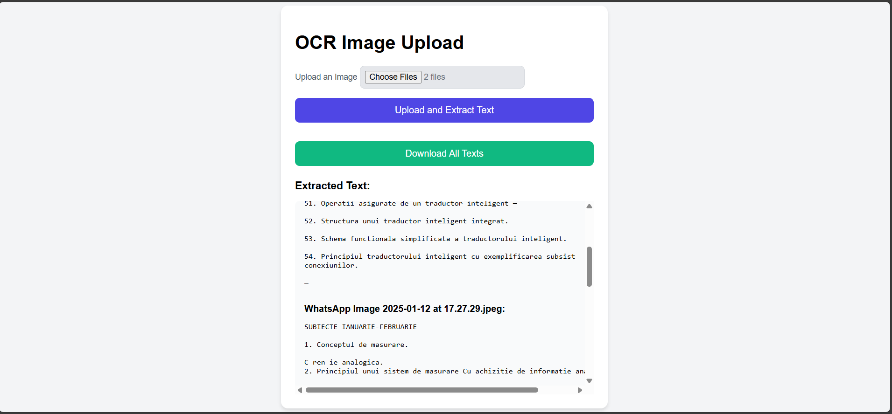

# Text-Extraction-From-Images  
📄 **Image Text Extractor with OCR**  

A user-friendly web application that utilizes Optical Character Recognition (OCR) to extract text from uploaded images.  

### Why I Built This  
During my university exam session, I needed a reliable tool to extract text from images. The available options were paid, so I created this free solution.  

### Features  
- 🖼️ Upload images and extract text with ease.  
- 🔍 Preview the extracted text directly on the website.  
- 📦 Download the extracted text as a ZIP file for offline use.  

### Installation & Setup  

1. Install the necessary libraries:  
   ```bash
   pip install flask flask-cors pillow pytesseract
   pip install Flask
   ```

2. Download the Tesseract OCR installer from [here](https://github.com/tesseract-ocr/tesseract) and install it.  

3. Add Tesseract to your system PATH:  
   ```
   C:\Program Files\Tesseract-OCR\
   ```

4. Verify the installation by running the following command:  
   ```bash
   tesseract --version
   ```

5. Run the app:  
   Navigate to the folder with the `main.py` file open and run:  
   ```bash
   python main.py
   ```

### 📸 Screenshots  
Here’s a glimpse of the app:  
  
  
