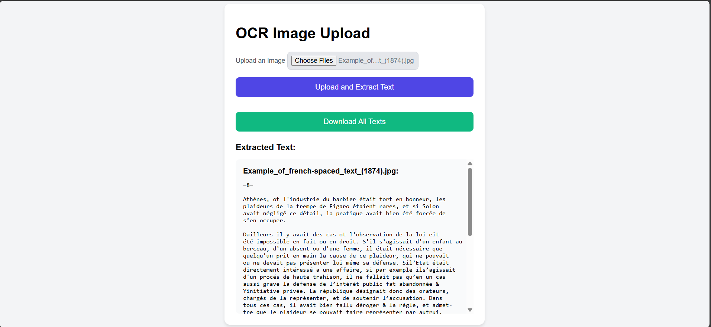

# Text-Extraction-From-Images  
📄 **Image Text Extractor with OCR**  

A user-friendly web application that utilizes Optical Character Recognition (OCR) to extract text from uploaded images.  

### Why I Built This  
During my university exam session, I needed a reliable tool to extract text from images. The available options were paid, so I created this free solution.  

### Features  
- 🖼️ Upload images and extract text with ease.  
- 🔍 Preview the extracted text directly on the website.  
- 📦 Download the extracted text as a ZIP file for offline use.  

### 📸 Screenshots  
Here’s a glimpse of the app in action:  
  
  
